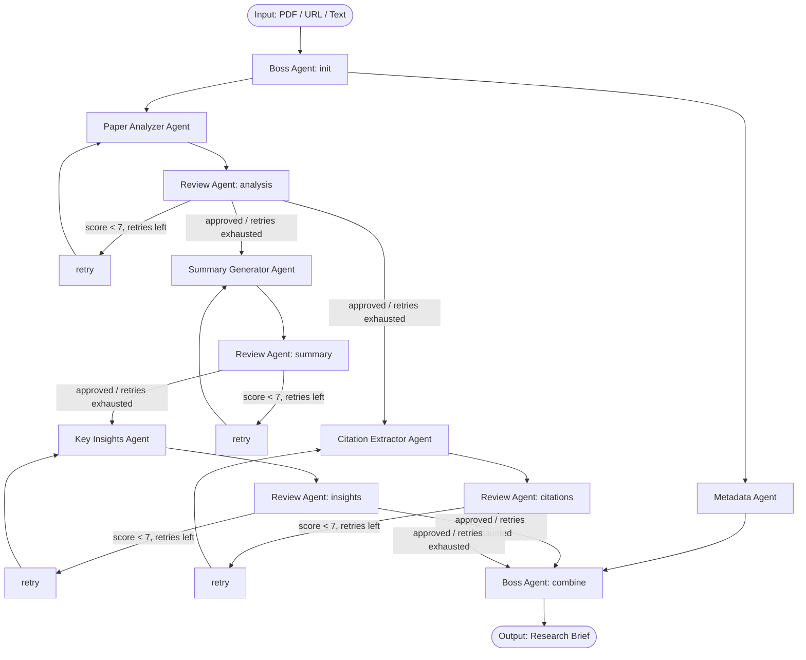

# AI-Powered Research Paper Analyzer

A multi-agent system that reads a research paper (PDF, URL, or pasted text) and produces
a structured research brief: analysis, executive summary, citations, and key insights -
with an automated Review Agent that scores every sub-agent's output and triggers
regeneration when quality is below threshold.

Built with **LangGraph** (state-based multi-agent orchestration) and the **OpenAI API**
(`gpt-4o-mini` by default) with structured JSON outputs via Pydantic schemas (native
`response_format=<PydanticModel>` support, so there's no manual JSON-schema wrangling).

## Demo

- Video: `<add your Google Drive link here before submitting>`
- Live UI (optional): `<add your deployed Streamlit/Railway link here if you deploy it>`

## Architecture

```
Input (Research Paper PDF/URL/Text)
            |
      Boss Agent (init)
       /            \
Metadata Agent    Paper Analyzer Agent
       |                |
       |          Review Agent -> [score < 7? retry, up to 2x]
       |                |  (approved)
       |        +-------+-------+
       |        |               |
       |  Summary Generator   Citation Extractor
       |        |               |
       |  Review Agent      Review Agent -> [retry, up to 2x]
       |        |  (approved)    |
       |  Key Insights Agent     |
       |        |                |
       |  Review Agent -> [retry, up to 2x]
       |        |                |
       +--------+--------+-------+
                |
        Boss Agent (combine)
                |
     Output: Complete Research Brief
```

Mermaid version (renders directly on GitHub):



### Design decisions

- **Metadata Agent runs in parallel with the Paper Analyzer** - it's independent and
  doesn't need the analysis to complete first.
- **Citation Extractor runs in parallel with Summary Generator** - both only depend on
  the *approved* analysis + paper text, not on each other.
- **Key Insights runs after Summary is approved** (not in parallel with it) - its prompt
  is explicitly grounded in the summary text, so this is a deliberate sequential
  dependency rather than an oversight.
- **The final "combine" node has three incoming branches** (metadata, the
  insights-branch, the citations-branch) that finish at different times because retries
  make branch lengths variable. LangGraph fires a node whenever *any* predecessor
  arrives - it does not implicitly wait for all of them (no automatic AND-barrier across
  supersteps). `boss_combine` therefore checks that every required piece of state is
  actually present before assembling the brief, and is a safe no-op otherwise. This was
  a real bug caught during development (see `tests/test_graph_dry_run.py`) - worth
  knowing if you extend this graph with your own fan-in points.
- **Review/retry loop**: each generating agent's review score (1-10) is checked against
  `QUALITY_THRESHOLD` (default 7). Below threshold, the agent regenerates with the
  reviewer's feedback injected into its prompt, up to `MAX_RETRIES` (default 2) times,
  then force-proceeds with the best attempt so the pipeline never hangs.
- **Structured outputs everywhere**: every agent call uses OpenAI's structured outputs
  (`client.beta.chat.completions.parse` with a Pydantic model passed directly as
  `response_format`), so there's no regex/string parsing of LLM output anywhere in the
  pipeline, and no manual JSON-schema construction either.

## Project structure

```
app/
  schemas.py      # Pydantic models for every agent's structured output
  state.py        # LangGraph state schema (with reducers for parallel branches)
  prompts.py      # Prompt templates per agent
  llm.py          # OpenAI client wrapper: structured output + retry/backoff
  pdf_utils.py    # PDF / URL / text ingestion
  agents.py       # Node functions: Boss, Metadata, Analyzer, Summary, Citations,
                  # Insights, and the generic Review Agent + retry routing
  graph.py        # LangGraph StateGraph wiring (the architecture above)
cli.py            # Command-line runner
streamlit_app.py  # Bonus UI: live per-agent progress, scores, retry history
api.py            # Bonus FastAPI wrapper (POST /analyze, /analyze/upload)
sample_data/
  sample_paper.txt            # Original synthetic sample paper (avoids reproducing
                               # copyrighted text) used for the example run below
  sample_research_brief.md    # Example output produced by this pipeline
tests/
  test_graph_dry_run.py       # Mocked-LLM control-flow test (fan-out, retries, fan-in)
```

## Setup

```bash
git clone <this-repo-url>
cd research-paper-analyzer
python -m venv venv && source venv/bin/activate   # optional but recommended
pip install -r requirements.txt
cp .env.example .env
# then edit .env and add your OPENAI_API_KEY (https://platform.openai.com/api-keys)
```

## Usage

### CLI

```bash
python cli.py --pdf sample_data/some_paper.pdf
python cli.py --url https://arxiv.org/pdf/1706.03762
python cli.py --text "$(cat sample_data/sample_paper.txt)"
```

Writes the brief to `outputs/research_brief.md` and prints it to the terminal along with
the full workflow trace (which agent ran, review scores, retries).

### Streamlit UI (bonus)

```bash
streamlit run streamlit_app.py
```

Upload a PDF, paste a URL, or paste raw text. Shows live progress per agent, review
scores as they land, and the retry/iteration history, then lets you download the brief.

### FastAPI (bonus)

```bash
uvicorn api:app --reload
```

- `GET /health`
- `POST /analyze` with JSON `{"url": "..."}` or `{"text": "..."}`
- `POST /analyze/upload` with a multipart PDF file

### Running the control-flow test (no API key required)

```bash
python tests/test_graph_dry_run.py
```

Mocks the LLM layer to verify the graph's fan-out, retry loop, and fan-in barrier logic
without spending real API calls.

## Sample input & output

- Input: [`sample_data/sample_paper.txt`](sample_data/sample_paper.txt) - an original,
  synthetic paper written for this demo (not a reproduction of copyrighted text), covering
  a fictional-but-plausible efficient-attention method.
- Output: [`sample_data/sample_research_brief.md`](sample_data/sample_research_brief.md) -
  the brief this pipeline produced for that input, including one automatic retry on the
  Summary Generator branch (its first draft was too short and got regenerated with the
  reviewer's feedback).

## Known limitations

- PDF text extraction (via `pdfplumber`) can struggle with multi-column academic layouts,
  embedded figures/tables, and scanned (non-text) PDFs; text-heavy single/double-column
  arXiv-style PDFs work best.
- Very long papers are truncated to ~60k characters (see `MAX_CHARS` in `app/pdf_utils.py`)
  to stay within context limits across the several LLM calls each paper triggers.
- The Review Agent is itself an LLM call and can occasionally misjudge quality; if it
  errors outright, the pipeline auto-accepts the draft rather than blocking, and logs a
  warning in `errors`/`log`.
- Citation extraction quality depends on how cleanly the paper's reference list survived
  PDF-to-text extraction; if a reference section is malformed or missing entirely, the
  agent falls back to in-text citations where possible and notes the limitation.
